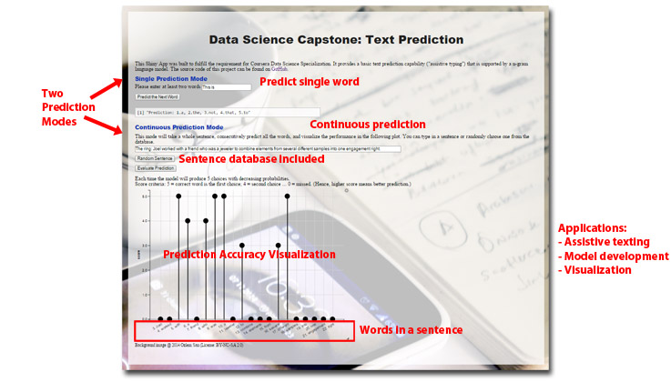
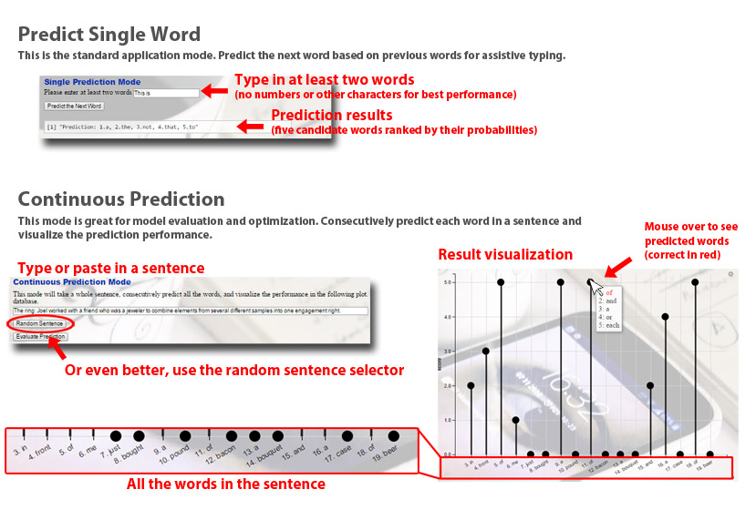

## Introduction

Introduce a new text prediction application based on "big data" text analytics and machine learning technologies. https://lifan.shinyapps.io/TextPredictApp/

 

## User Interface and Functionalities

## Data and Algorithm

#### Data

For this work, we used the US news article data set ("en_US.news.txt") which contains over 1 million news items and approximate 50 million words.

#### Algorithm

The text prediction was supported by a n-gram language model. More specifically it combines a 3-gram, a 2-gram and a unigram model with decreasing priority in a prediction process. As an example, it will first invoke the 3gram model with two previous words as key, and then the 2-gram model with one previous word, and finally the unigram model. Then, it will return the 5 most probably words to user.

#### Source code

This project is 100% open-source. All the source codes are available on [GitHub](https://github.com/lifan0127/DSCapstoneProject).

## Summary & Path forward

* We developed a text prediction model that has great potential for next-generation assistive typing applications on Mobile devices. 
* For demonstration, we built a web-based application that support text prediction evaluation and model visualization.
* There are ample opportunities for improvement of the statistical model and development of end-use applications.
* We are currently seeking a partnership that can provide fund to support 3 month full-time development and a dedicated server to launch a public preview version of the application.
* Thank you!

